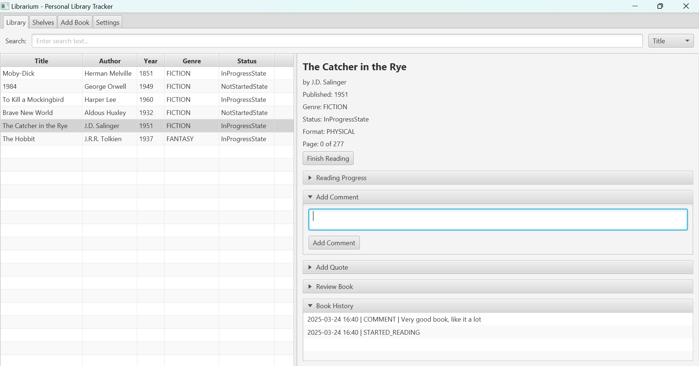

# BookKeep Library Management System

**BookKeep** is a personal library tracker designed to help you manage your owned and wishlist books, monitor your reading progress, and keep a history of book-related activities. The system is implemented using Java with JUnit 5.7 for testing.

## Features



### Core Functionality

- **Personal Library:** Track all your owned books.
- **Wishlist:** Manage books you want to read. (TODO)
- **Book Details:** Includes pages, author info, genre, and more.
- **Book Status:**
  - Owned: Physical/Digital, Read/Not Read.
  - Track reading progress or ratings.
  - Optional: Physical location tracking (e.g., loan status). (NOT IN UI)
- **History:** Keep logs of reading updates, ratings, and comments.
- **Quotes:** Store memorable quotes from books. (NOT IN UI)
- **Statistics:** Track overall reading performance and generate insights. (NOT IN UI)

### Advanced Features

- Custom shelves for personalized categorization.
- Time tracking for book completion.
- Object serialization file storage. (Future JSON-based/SQL/Firebase).  
- Advanced search and filtering capabilities across book attributes.

## Tech Stack

- **Java 21**: Core application logic.
- **JUnit 5.7**: Testing framework.
- **(PLanned): JSON**: Data persistence (or SQL/Firebase).

## Directory Overview

- `src/main/java/bookkeep`: Main application logic.
  - `models`: Book data models (owned, wishlist, states).
  - `ui`: User interface (LibraryMenu for interaction).
  - `services`: Book management services.
  - `persistance`: Library serialization/deserialization.
- `src/test`: Unit tests for core functionality.

## Setup Instructions

1. Clone the repository:

   ```bash
   git clone https://github.com/yourusername/bookkeep.git
   cd bookkeep
   ```

2. Build the project using Maven:

   ```bash
   mvn clean install
   ```

3. Run the application with terminal UI:

   ```bash
   java -cp target/bookkeep.jar bookkeep.app.Main
   ```

   Run the application with JavaFX UI:

   ```bash
   mvn javafx:run
   ```

## Future Enhancements

- SQL-based persistence.
- Web integration and multiplayer functionality.
- Reading suggestions using LLMs.
- Gamification: Reading goals, achievements, reminders.

## LLM Usage
JUnit testing and user interface logic is written by LLMs.
